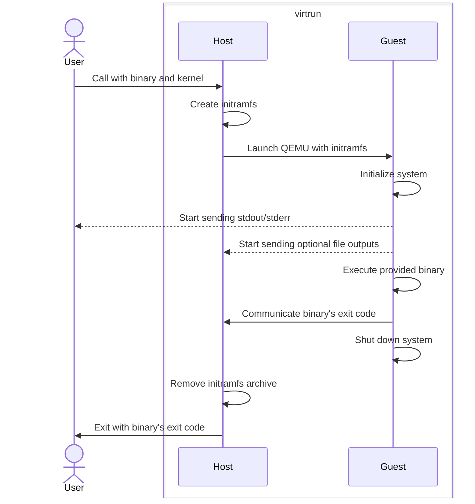

<!--
SPDX-FileCopyrightText: 2024 Tobias Böhm <code@aibor.de>

SPDX-License-Identifier: GPL-3.0-or-later
-->

# virtrun

[![PkgGoDev][pkg-go-dev-badge]][pkg-go-dev]
[![Go Report Card][go-report-card-badge]][go-report-card]
[![Actions][actions-test-badge]][actions-test]

virtrun allows you to run a binary in an isolated QEMU guest Linux system. It
supports running go test binaries via `go test -exec`.

## Quick Start

To use virtrun as a Go tool for executing tests in your project:

```console
$ go get -tool github.com/aibor/virtrun@latest
$ export VIRTRUN_ARGS="-kernel=/boot/vmlinuz-linux"
$ go test -exec "go tool virtrun" ./...
```

## Supported architectures:
- amd64 (x86_64)
- arm64 (aarch64)
- riscv64

## Requirements

### QEMU

QEMU must be present for the architecture matching the binary. By default, the
following QEMU binaries are used:
- `qemu-system-x86_64`
- `qemu-system-aarch64`
- `qemu-system-riscv64`

The architecture of the binary determines which QEMU binary is used. You can
override the default choice with the `-qemuBin` flag.

### Linux Kernel

The kernel must be compiled with support for running as a guest system.
Specifically, it must include support for a serial or virtual console. All
required features must be compiled directly into the kernel. Additional kernel
modules can be loaded for functionality required by the binary itself using the
`-addModule` flag.

You must provide the absolute path to the kernel using the `-kernel` flag.
Ensure the kernel matches the architecture of your binaries and the QEMU binary.

Virtrun supports different QEMU I/O transport types. The required transport type
depends on the kernel and QEMU machine type used. By default, virtrun
automatically selects the most likely correct I/O transport. You can manually
set the transport type using the `-transport` flag:
- For amd64, `pci` is usually the correct choice.
- For arm64 and riscv64, `mmio` is typically used.
- `isa` can be tried as a fallback if there is no output.

The Ubuntu generic kernels work out of the box and include all necessary
features.


## Installation

### Pre-built binaries

Each release provides pre-built binaries that can be downloaded from the
release page and used directly.

### go install

```console
go install github.com/aibor/virtrun@latest
```

### As go tool

If virtrun is used for go tests in your project, it can be installed as go tool:

```console
$ go get -tool github.com/aibor/virtrun@latest
```


## Usage

By default, virtrun provides a simple init program that sets up the guest system
and executes the given binary. The binary will be a direct child of PID 1.

All arguments after the binary are passed to the guest's `/init` program. The
default init program forwards them to the binary.

Usage: `virtrun [flags...] binary [args...]`

### Flags

Flags to virtrun can either be passed directly as arguments, via environment or
via local file.

#### Environment Variable

You can also pass all flags through the `VIRTRUN_ARGS` environment variable:

```console
$ export VIRTRUN_ARGS="-kernel /boot/vmlinuz-linux"
$ virtrun /path/to/some/binary_to_run
```

#### Configuration File

Flags can also be read from a local file named `.virtrun-args`, which should
contain one argument per line. Environment variables can be used and will be
expanded. Flags from the local file take precedence over flags from the
environment. Note that with `go test`, virtrun's working directory is the
directory of the tested package. This allows you to set individual virtrun flags
for a Go package.

```console
$ cat .virtrun-args
-kernel=$TEST_KERNELS/vmlinuz
-addModule=$TEST_KERNELS/veth.ko.zst
-smp=4
```

### Standalone Mode

In Standalone mode, the given binary is executed as `/init` directly. For this
to work, your binary must perform any necessary system setup. The only essential
required task is to communicate the exit code on stdout and shut down the
system.

The sub-package [sysinit](https://pkg.go.dev/github.com/aibor/virtrun/sysinit)
provides helper functions for these tasks.

You can build a simple init using `sysinit.Run`, which is the main entry point
for an init system. It runs user-provided functions and shuts down the system on
termination. For an example, see the 
[simple init program](internal/initramfs/init/cmd/main.go) that is embedded in the
virtrun binary and used as the init in the default wrapped mode.

Standalone mode is enabled by using the `-standalone` flag.

### Examples

The following examples assume virtrun is installed in a directory that is in
`$PATH`.

Let's use `env` as our main binary to demonstrate simple invocation and default
environment variables:

```console
$ virtrun -kernel /boot/vmlinuz-linux /usr/bin/env
HOME=/
TERM=linux
PATH=/data
```

Let's use `ip` to inspect the guest's network stack. The loopback interface is
initialized by the init program:

```console
$ virtrun -kernel /boot/vmlinuz-linux /usr/bin/ip address
1: lo: <LOOPBACK,UP,LOWER_UP> mtu 65536 qdisc noqueue state UNKNOWN group default qlen 1000
    link/loopback 00:00:00:00:00:00 brd 00:00:00:00:00:00
    inet 127.0.0.1/8 scope host lo
       valid_lft forever preferred_lft forever
    inet6 ::1/128 scope host proto kernel_lo
       valid_lft forever preferred_lft forever
```

You can add additional files to the guest system using the `-addFile` flag,
which can be specified multiple times. These files are added to the `/data`
directory. It does not preserve any directory structures. If this is needed,
consider adding an archive and unpack it in the guest.

The `PATH` environment variable is set to the `/data` directory, making it easy
to invoke binaries. Required shared libraries are also collected and added
to the default library directory.

The `tree` binary can be used to inspect the guest's file system. Let's add bash
as an additional file and print the resulting guest file system content:

```console
$ virtrun -kernel /boot/vmlinuz-linux -addFile /usr/bin/bash /usr/bin/tree -x
.
|-- data
|   `-- bash
|-- dev
|-- init
|-- lib
|   |-- ld-linux-x86-64.so.2
|   |-- libc.so.6
|   |-- libncursesw.so.6
|   |-- libreadline.so.8
|   `-- modules
|-- lib64 -> /lib
|-- main
|-- proc
|-- root
|-- run
|-- sys
|-- tmp
`-- usr
    `-- lib -> /lib
```

### Using with `go test -exec`

Virtrun can be used to run Go tests in a clean and isolated environment. It also
allows testing for different architectures or kernels. You can use virtrun with
the Go test's `-exec` flag by passing the complete virtrun invocation as a
string to this flag. Virtrun will be invoked for each test binary.

Since Go test changes into the package directory when running tests, you must
use absolute paths for any file paths passed to virtrun via flags (`-kernel`,
`-addFile`, `qemuBin`, etc.).

#### Installed as go tool

```console
$ go test -exec "go tool virtrun -kernel /boot/vmlinuz-linux" .
```

#### Installed in `$PATH`

```console
$ go test -exec "virtrun -kernel /boot/vmlinuz-linux" .
```

#### Not Installed in `$PATH`

```console
$ go test -exec "/go/bin/virtrun -kernel /boot/vmlinuz-linux" .
```

#### Running Cross-Compiled Tests

The kernel architecture must match the binary's architecture.

```console
$ export VIRTRUN_ARGS="-kernel /absolute/path/to/vmlinuz-arm64"
$ GOARCH=arm64 go test -exec virtrun .
```

#### Supporting Go Test Flags

Virtrun supports some Go test flags that set output files, such as coverage or
resource profile files. It uses virtual consoles to write the content from the
guest system back to the host:

```console
$ go test -exec virtrun -cover -coverprofile cover.out .
```

#### Debugging

For debugging, use virtrun's flags `-verbose` and `-debug` together with Go
test's flag `-v`:

```console
$ go test -exec "virtrun -verbose -debug" -v .
```


## Internals

### Exit Code Communication

Virtrun wraps QEMU and runs an init program that executes the binary and
communicates its exit code via a defined formatted string on stdout. This string
is parsed by virtrun. All other output on stdout is printed directly as-is.

### File Output

For writing to files on the host (such as Go test profiles), a dedicated virtual
console is established for each file. To accommodate any binary data
transmission, the data is written in base64 encoded format to the serial
console.

### Architecture Detection

The architecture of the main binary determines the default settings. The QEMU
executable, machine type, and transport type are set based on the main binary's
architecture unless explicitly specified by flags. KVM is enabled if present,
accessible, and not explicitly disabled. See `virtrun -help` for all available
flags.

### Workflow

- **Host**
  - Determine the architecture from the provided binary.
  - **Build initramfs**
    - Select the init program that matches the architecture.
    - Gather shared libraries required by the binary and any additional files.
    - Create an initramfs virtual file system containing:
      - `/init`: The init program.
      - `/main`: The provided binary.
      - `/data`: All additional provided files.
      - `/lib/modules`: Modules in the specified order.
      - `/lib`: Shared libraries required by the binaries.
      - `/run`: Runtime directory.
      - `/tmp`: Temporary files directory.
    - Write the initramfs into a temporary cpio archive file.
  - **Prepare QEMU command**
    - Select the QEMU binary, machine type, and transport type based on the
      required architecture.
    - Rewrite go test flags, replacing file paths with serial consoles that the
      guest writes into. The host forwards the data into the actual files.
    - Open any optional additional output files.
    - Set up base 64 encoded serial console output parsers to parse and write
      any output.

- **Guest**
  - **Initialize system**
    - Mount special filesystems.
    - Load kernel modules.
    - Initialize the loopback network interface.
    - Set up output pipes to the host via serial consoles.
  - Execute the provided binary.
  - Communicate the binary's exit code.
  - Shut down the system.

- **Host**
  - Close any optional additional output files.
  - Remove the initramfs archive.
  - Exit with the guest's binary exit code.



[pkg-go-dev]:           https://pkg.go.dev/github.com/aibor/virtrun
[pkg-go-dev-badge]:     https://pkg.go.dev/badge/github.com/aibor/virtrun
[go-report-card]:       https://goreportcard.com/report/github.com/aibor/virtrun
[go-report-card-badge]: https://goreportcard.com/badge/github.com/aibor/virtrun
[actions-test]:         https://github.com/aibor/virtrun/actions/workflows/test.yaml
[actions-test-badge]:   https://github.com/aibor/virtrun/actions/workflows/test.yaml/badge.svg?branch=main
